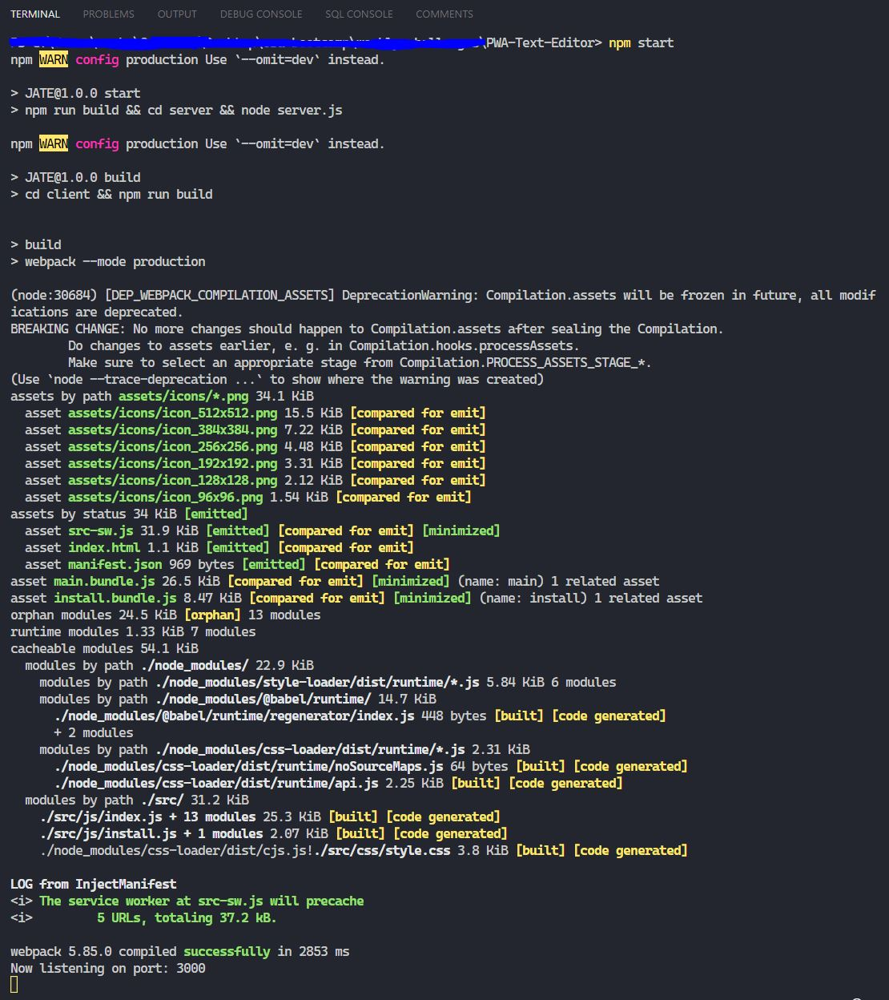
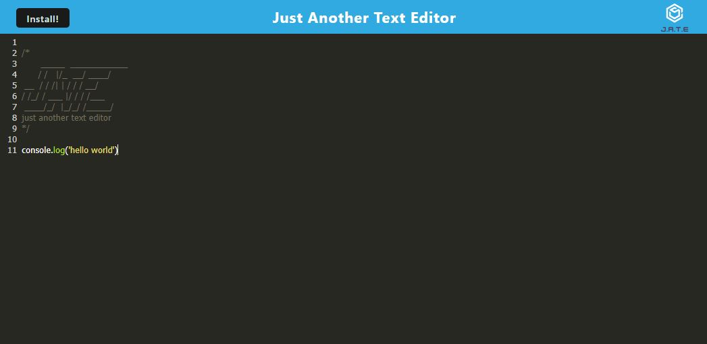
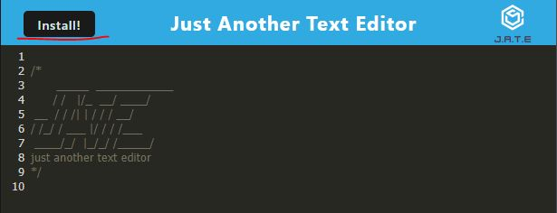

# PWA Text Editor

  
*Just Another Text Editor* that meets the PWA criteria! This application is a single-page app that features a number of persistant data techniques that serve as redundancy in case one of the options is not supported by the browser. *J.A.T.E.* will also function offline by implementing methods for getting and storing data to an IndexedDB database.
  
  
## Table of Contents

- [Installation](#installation)
- [Usage](#usage)
- [Technologies Used](#technologies-used)
- [Contributing](#contributing)
- [Tests](#tests)
- [Project Links](#project-links)
- [License](#license)
- [Questions](#questions)

## Technologies Used

## Installation

Please follow these steps to install and run the project on your local machine:

1. Clone the repository
2. Install dependencies by opening the cloned repository and run the command `npm install`
3. Run `npm start` in your terminal

4. Open the application on http://localhost:3000/

## Usage
  
To use this project, follow these steps:

1. Visit the deployed application: https://pwa-jate-zkm.herokuapp.com/
2. Install the application(optional)

## Contributing

This project is not currently available for contribution.

## Tests

To run tests on this project, follow these steps:

Testing instructions will be available in a future update.
  
## Project Links
  
Deployed Application: https://pwa-jate-zkm.herokuapp.com/

Github Repository: https://github.com/that-devguy/PWA-Text-Editor

## License

This project is licensed under the MIT license. Feel free to edit and distribute this template as you like.

See  for more information.

## Questions

If you have any questions or issues, feel free to reach out to me via my GitHub profile: [that_devguy](https://github.com/that_devguy) or email me at zkmutch@gmail.com.